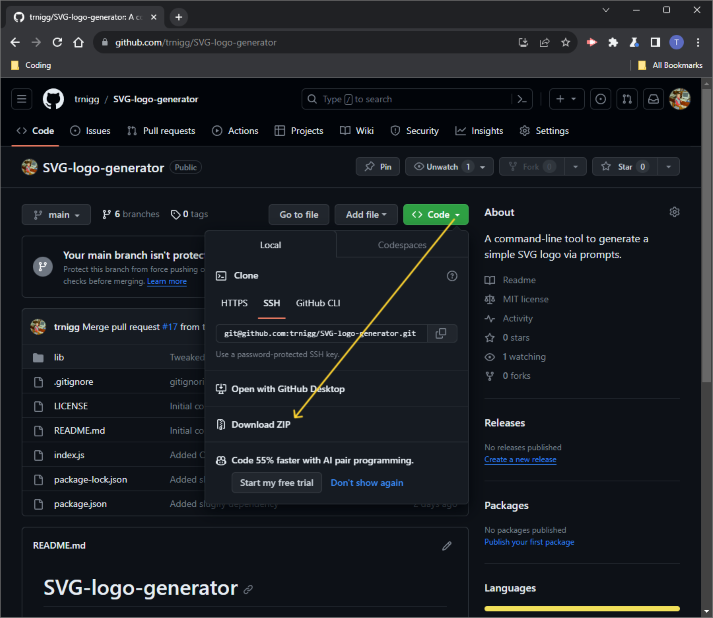
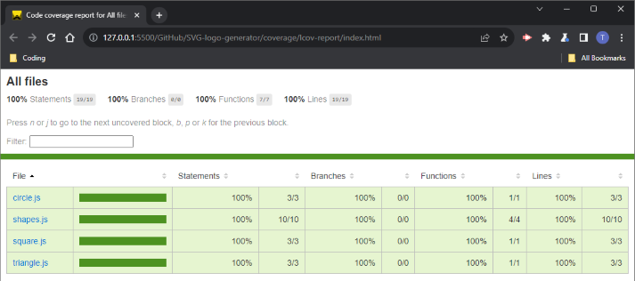

# SVG Logo Generator
(```SVG-logo-generator``` - Module 10 Challenge)  

A command-line tool to generate a simple SVG logo via prompts.

## Description
- This application allows you to dynamically generate a simple Scalable Vector Graphics (SVG) logo by answering just a handfull of prompts in your console!
    - The prompts let you specify the shape and colour for your logo, as well as the text-content, font-style and colour.
- It is written in JS using the [Node.js](https://nodejs.org/en) runtime environment, leveraging [Inquirer v8.2.4](https://www.npmjs.com/package/inquirer/v/8.2.4) for terminal/command-line question/answer-prompt functionality and [Jest v29.7.0](https://www.npmjs.com/package/jest/v/29.7.0).

## Table of Contents
- [Installation](#installation)
- [Usage](#usage)
- [Tests](#tests)
- [Roadmap / Known Bugs](#roadmap--known-bugs)
- [License](#license)
- [Questions](#questions)

## Installation
Before installing the application, please ensure you have installed [`Node.js`](https://nodejs.org/en) and `npm`.

To install the application: 
1. Visit the [SVG-logo-generator](https://github.com/trnigg/SVG-logo-generator) repo on GitHub.
2. Download and extract the `.zip` of the repository to your desired directory:  

3. Navigate to the directory using the console, or open it in an integrated terminal.
4. Enter `npm i` or `npm install` in your console or integrated terminal to retrieve and install the required dependencies and create a folder to store these (`./node_modules`), as depicted below:  


## Usage
To use the application: 
1. While in the directory it is stored in (see [Installation](#installation) above), enter `node index.js` in the console to run the application.
2. You will be given some brief instructions that require confirmation. Enterr `y` to confirm you understand and wish to continue.
3. You will then be asked a number of questions in the terminal; answer these as directed to generate your personalised logo.
    - Please take note of the questions regarding colour-choices. Colours can be specified as either:
        - **Colour keyword names**. See the guide below for a list of recognised colour keywords:  
        
            - These may be entered in natural language, using spaces - the app will normalise your input (e.g. 'light sky blue' will become `lightskyblue`);
        - **Hex colour codes**. These must be 6-characters long and preceded with a `#`. Please see above for examples, and/or use a [colour-picker tool](https://htmlcolorcodes.com/) to help find a valid hex colour code.
    - Currently there is no validation of colour-responses (please see [Roadmap / Known Bugs](#roadmap--known-bugs)). Unrecognised or invalid colour entries will default to `black`.  
4. If you make a mistake and wish to restart, currently the only way to do this is by pressing `ctrl + c` on Windows or `⌘ + c` on Mac. Unfortunately, you will need to begin at **Step 1** again and none of your answers will have been saved.
5. The last question is regarding the **file-name** for your project. Once you complete this, an `.svg` file titled with your response and containing your logo will be created in the directory you are in.
    - If nothing is entered, the default name (including extension) for your file will be `logo.svg`.
    - Any unsafe characters for use in a filename will be removed and the filename will be converted to kebab-case (e.g., entering 'My Logo' will return a file called `my-logo.svg`).

Note: you can repeat this process from **Step 1**, but if you choose a file-name for your generated logo that already exist in your directory, it will be overwritten.

>- Please click [here](https://drive.google.com/file/d/1FHw_P7-TBlXn5sWdn1mgUA5lwPY8jM_-/view) to watch a video-walkthrough of the **usage** process.
>   - Please note, the above walkthrough begins at the final stage of installation described above.  
>- The repo also contains the [example README](./assets/exampleREADME.md) generated in the above walkthrough.

## Tests
- To run the tests for the application, after [installing](#installation) enter `npm test` in your terminal.
- Due to contraints in developement-time, only a crucial subsection of the code has had tests implemented. These tests achieve 100% coverage where implemented, and all pass:  


## Roadmap / Known Bugs
The following is a non-exhaustive list of items I would like to address with more development time in the future:
### Features
- The app would benefit from a feature allowing 'backwards navigation' through the prompts, in case a mistake is made and the user wishes to go back to change a previous questions.
- Another beneficial feature would be to display the answers to the user in the console before generating the logo, followed by questions that would allow the user to go through and edit or change their answers.
- As mentioned in the [Usage Guide](#usage) above, currently there is no validation on colours, which could lead to failures to render desired colour *without* notifying the user.
    - One solution would be to implement a validator package such as [Validate Colour](https://www.npmjs.com/package/validate-color/v/2.2.1) to handle this. Thank-you to [rtrevill](https://github.com/rtrevill) for pointing me towards this!
### Tests
- As mentioned earlier, only a subsection of code has tests written for it. Although it is too late, to take a test-first approach to the code for the features already written, it would nonetheless beneficial to implement further tests in the feature:
    - This will help ensure that any future modifications to the code (or implementation of any new features) does not break anything in the existing code.

## License
- This project is licensed under the [MIT License](https://choosealicense.com/licenses/mit).
- Please refer to the [license](./LICENSE) section in the repo for further information.

## Questions
- For any questions, issues or feedback, please reach out to me on GitHub at [trnigg](https://github.com/trnigg/).